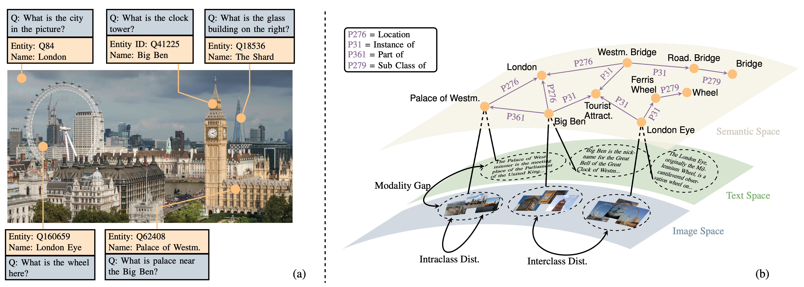

# Seeing and Knowing in the Wild: Open-domain Visual Entity Recognition with Large-scale Knowledge Graphs via Contrastive Learning

## Purpose of the project
This software is a research prototype, solely developed for and published as part of the publication [Seeing and Knowing in the Wild: Open-domain Visual Entity Recognition with Large-scale Knowledge Graphs via Contrastive Learning](https://arxiv.org/abs/2510.13675) which has been accepted by **AAAI 2026**. This repository provides the official implementation of **KnowCoL**, a **Know**ledge-**g**uided **C**ontrastive **L**earning framework presented in our paper.

## Introduction

KnowCoL integrates visual features, text queries, and structured knowledge (e.g., Wikidata relations and Wikipedia descriptions) into a shared semantic space, enabling strong zero-shot generalization and robust disambiguation. The approach significantly improves recognition accuracy for rare and unseen entities while remaining lightweight compared to generative baselines.

## Requirements
### Create and activate your environment
```bash
conda env create -f environment.yml
conda activate my-env
```

## Dataset
Download the OVEN dataset from HuggingFace [here](https://huggingface.co/datasets/ychenNLP/oven/tree/main) 
Download Wikidata subgraph for OVEN benchmark [here](https://huggingface.co/datasets/zhKingg/wikidata_oven_subgraph/tree/main)
Download Wikipedia knowledge base for OVEN benchmark [here](https://huggingface.co/datasets/zhKingg/wikipedia_knowledge_base/)
Place the downloaded data under the appropriate directory expected by the datamodule. E.g.,
```bash
dataset/
├── oven_data/               # Processed OVEN annotations
├── oven_images/             # Image files associated with OVEN
├── test_data/               # Test split for evaluation
├── wikidata_subgraph_v1/    # Extracted Wikidata subgraph
│   ├── entity.txt           # List of entity IDs and labels
│   ├── relation.txt         # List of relation IDs and names
│   ├── triplet_h.jsonl      # Head-anchored knowledge graph triples
│   └── triplet_t.jsonl      # Tail-anchored knowledge graph triples
└── knowledge_base
    ├── wikipedia_images_full # contains the lead images on the Wikipedia
    ├── Wiki6M_ver_1_1.jsonl  # contains image paths of the entities. 
    └── wikidata_relation_1_1.jsonl # contains text descriptions of the entities.
```


## Training
```bash
python3 knowcol/training.py
```
config options:
- model.beta1: hyperparameter beta1
- model.beta2: hyperparameter beta2
- datamodule.batch_size: batch size for training
- trainer.max_epochs: epochs to train
...

## Testing
```bash
python3 knowcol/evaluations/oven_eval.py
```
specify the checkpoint and model in the python file

